# Cuba

Welcome! (づ｡◕‿‿◕｡)づ 
This is my final project on Cuba, where I will present to you the different methods I have used over the semester to create an accurate representation of Cuba's population. Using this data, I have then analyzed how Cuba's population correlates to its urbanized areas, roads, and healthcare facilities in its regions.

## Administrative Subdivisions of Cuba

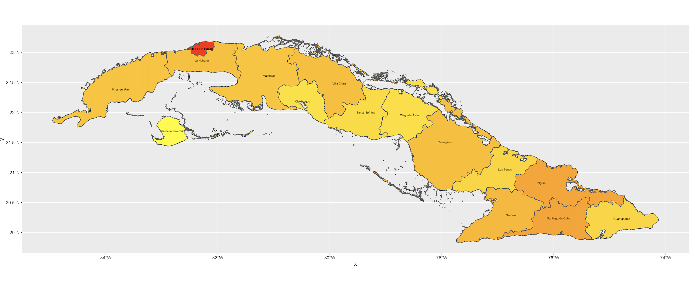

This plot depicts the national (adm0) and provincial (adm1) boundaries of Cuba, an island nation in the Caribbean Sea. Its most popular province is La Habana, wherein its capital, Havana, is located. Surrounding the main island are smaller pieces of land that did not contain any data regarding its populations; these smaller pieces of land also caused the generation of these plots to occur very slowly, making it difficult to not only plot the adm0 and adm1 data, but hindering the plotting of Cuba's district (adm2) boundaries.

Below is a plot of the same boundaries, but also displaying the population densities of each province in 2019.

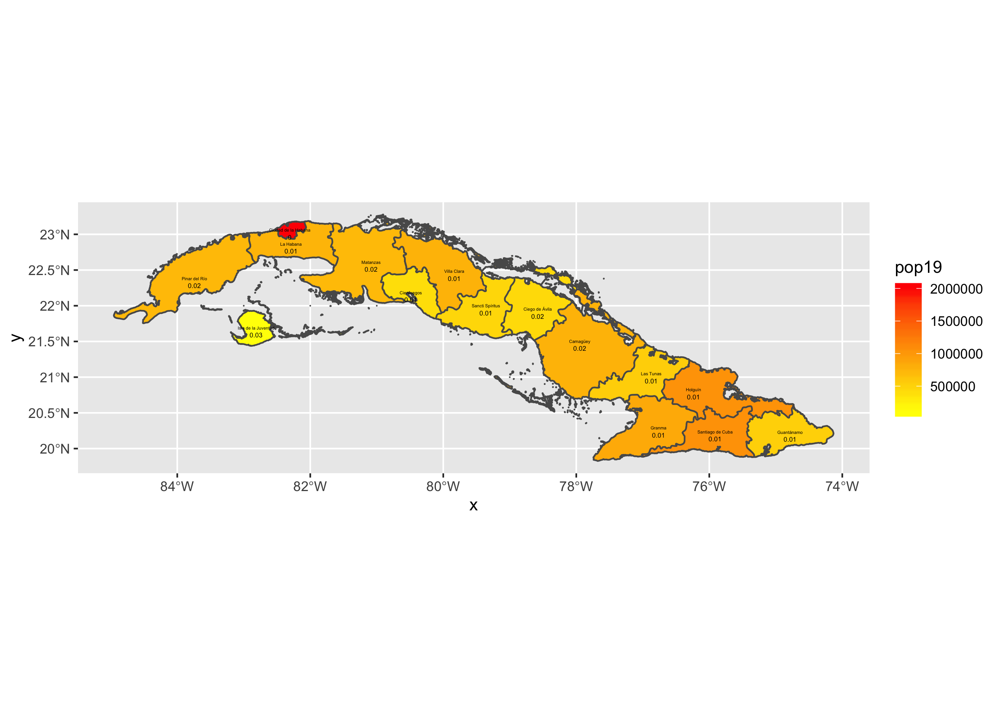

## Population of Cuba's Regions

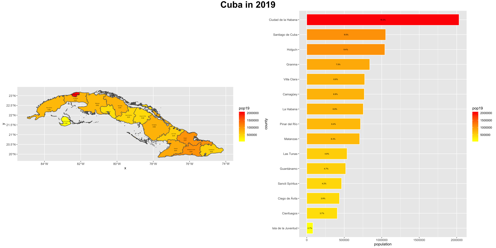
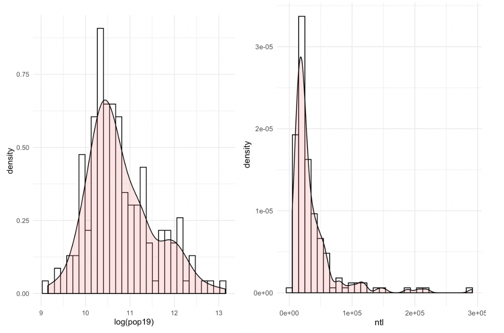
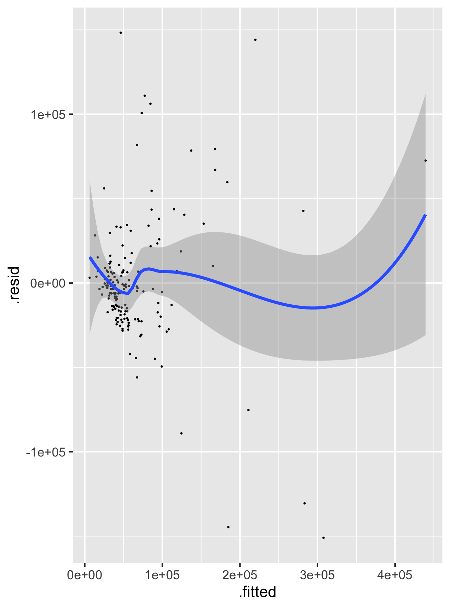
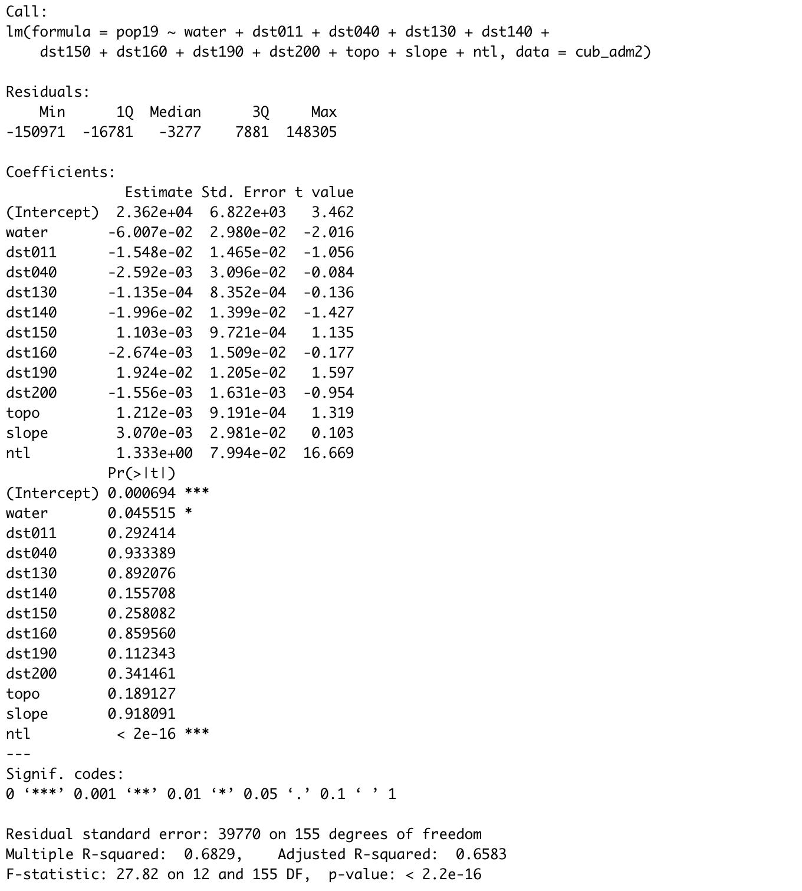
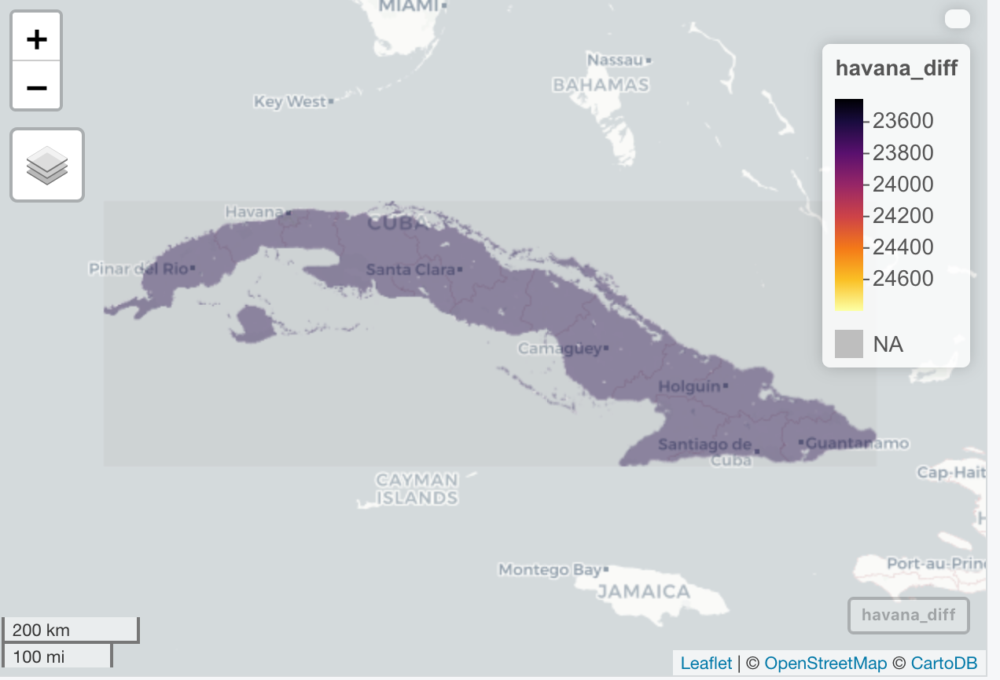

## Population Sums

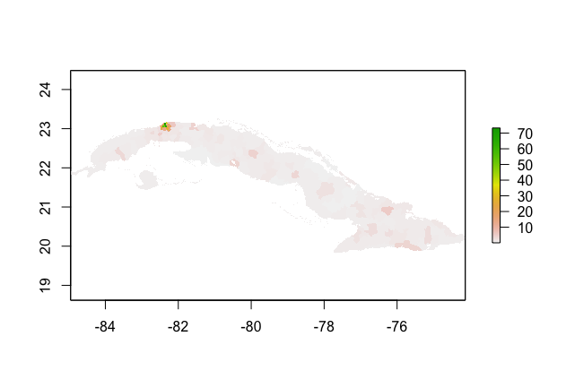
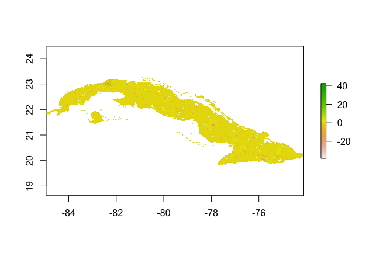
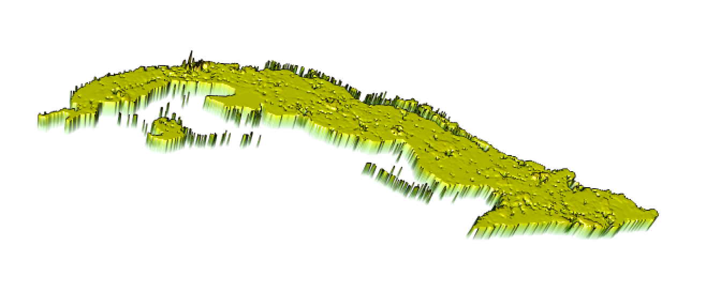

## Urban Areas

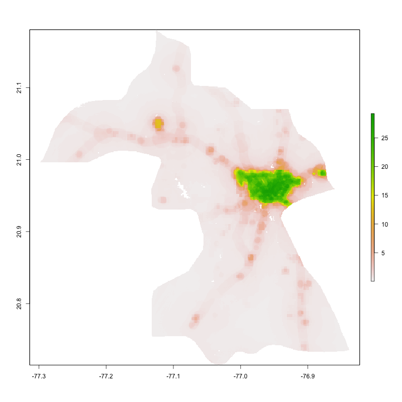

## Cuba's Human Settlements, Roadways, and Healthcare Facilities

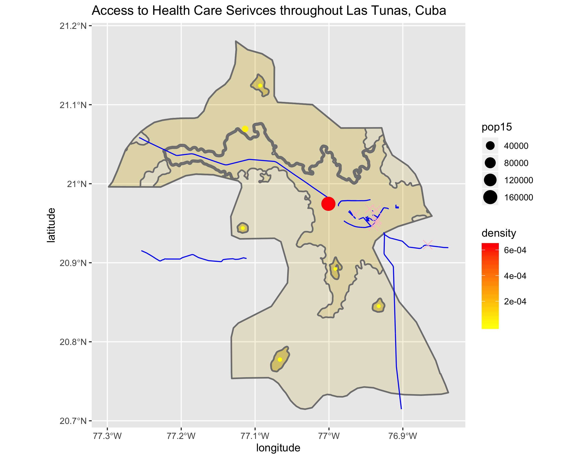
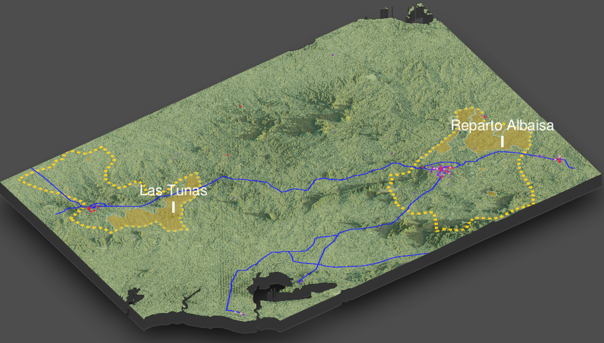
