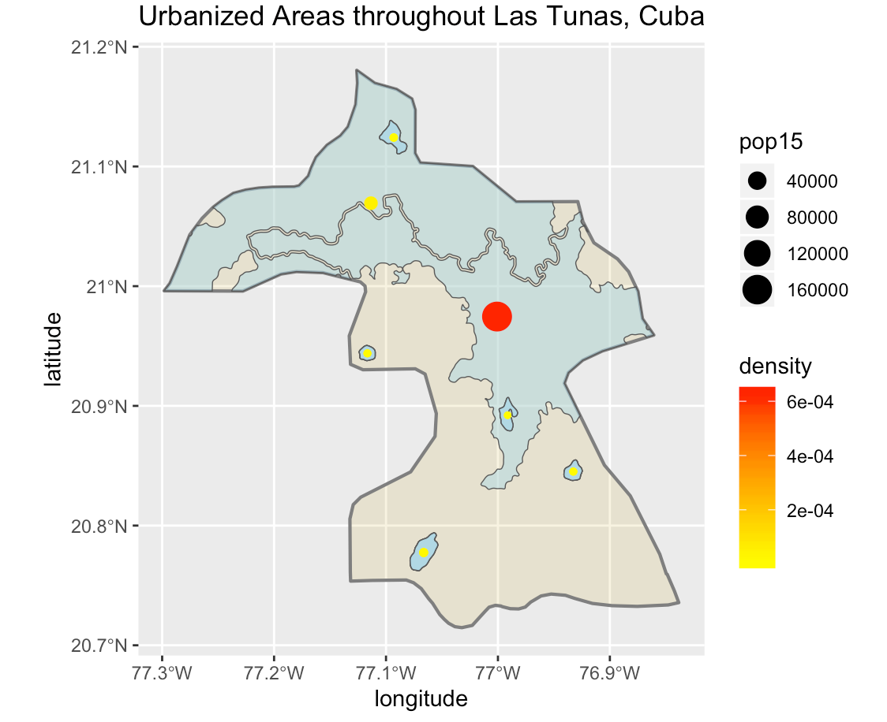

# Cuba

Welcome! (づ｡◕‿‿◕｡)づ 

This is my final project on Cuba, where I will present to you the different methods I have used over the semester to create an accurate representation of Cuba's population. Using this data, I have then analyzed how Cuba's population correlates to its urbanized areas, roads, and healthcare facilities in its regions.

## Administrative Subdivisions of Cuba

This plot depicts the national (adm0) and provincial (adm1) boundaries of Cuba, an island nation in the Caribbean Sea. Its most popular province is Ciudad de la Habana, wherein its capital, Havana, is located. Surrounding the main island are smaller pieces of land that did not contain any data regarding its populations; these smaller pieces of land also caused the generation of these plots to occur very slowly, making it difficult to not only plot the adm0 and adm1 data, but hindering the plotting of Cuba's district (adm2) boundaries.

Below is a plot of the same boundaries, but also displaying the population densities of each province in 2019.

## Population of Cuba's Regions

This plot and bar graph of Cuba illustrates how highly populated Ciudad de la Habana is, in which 18.3% of the population resides. On the other hand, one of the islands separated from the main island (Isla de la Juventud) contains only 0.7% of the population.

The two histograms above describe the most common population numbers and night time lights in cuba. While both the log of population and night time lights histograms are skewed right, the log of population displays a fairly normal distribution. This reinforces the accuracy of the bar graph, in which it reads a roughly skewed right population distribution, with one highly populated area in its capital region.

Above contains a regression model as well as the statistics for varibales such as water, topography, slope, and night time lights in Cuba in 2015. 

## Population Sums

These plots display the difference of sums for populations, which were generated after calculating the difference between each of my predicted populations and the correlating actual populations of Cuba. From this information, it was concluded that the plot for the difference of sums produced the best results because it yielded the smallest result (9544720).

The 2 plots above begin to display the urban areas throughout Cuba, with the most highly populated region being Ciudad de la Habana, which aligns with the information about population above.

This 3D plot displays the most densely populated areas with spikes; these spikes mainly reside in the northern areas of Cuba because that is where the most developed cities are located.

## Urban Areas

## Cuba's Human Settlements, Roadways, and Healthcare Facilities

